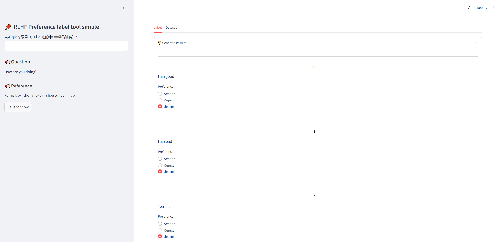

# RLHF-Label-Tool-simple
[中文](README.md)

A simple version of [RLHF-Label-Tool](https://github.com/SupritYoung/RLHF-Label-Tool)。RLHF-Label-Tool is a preference data label tool used in RLHF (Reforcement Learning with Human Feedback).

**User Interface**


## Quick Start
1. Install the depencies with `pip install -r requirements.txt`.

2. The dataset to be labeled is [/data/input_file.jsonl](data/input_file.jsonl):
```
{"question": "How are you doing?", "response": ["I am good", "I am bad","Terrible","Mind your own business"],"reference":"Normally the answer should be nice."}
{"question": "who are you?", "response": ["LLM", "Apple","Banana","Sea"], "reference":"This chatbot should be a robot or something."}
```
Please replace it with your own data, keep the file name unchanged.

3. Run
```bash
streamlit run app.py --server.port 8080
```
4. **You can only pick one Accept and one Reject for each question**, and if you pick dismiss for all the responses, this question will not be included in the final result file.
5. Click `Save`, the result will be saved to `/data/output_result.jsonl`。


## Thank
https://github.com/SupritYoung/RLHF-Label-Tool
